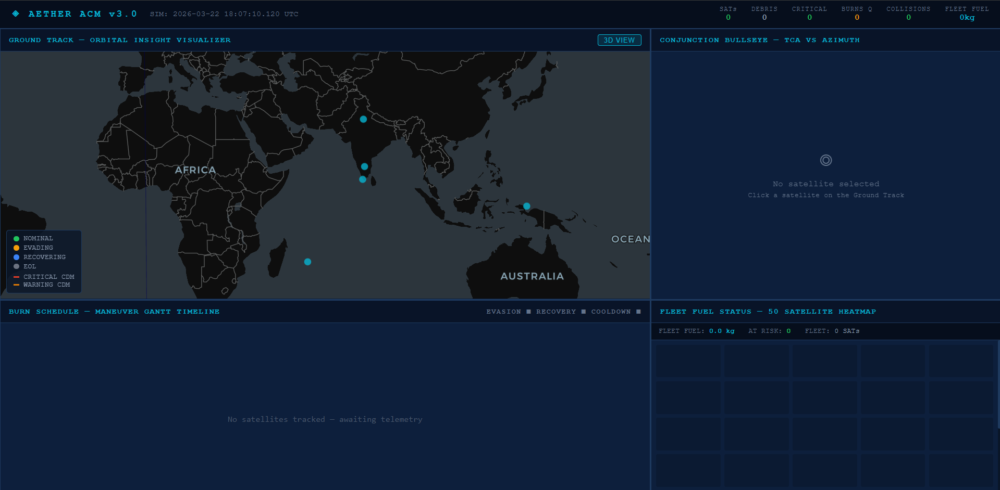
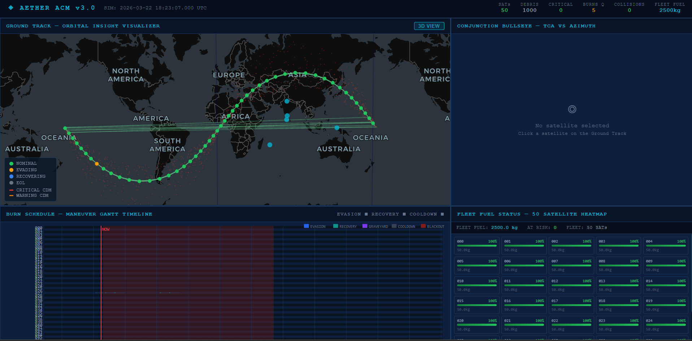
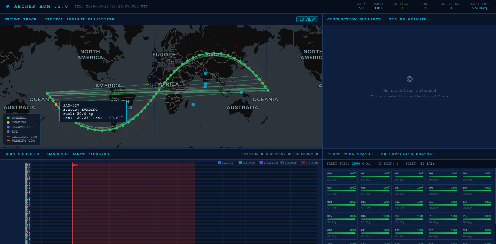
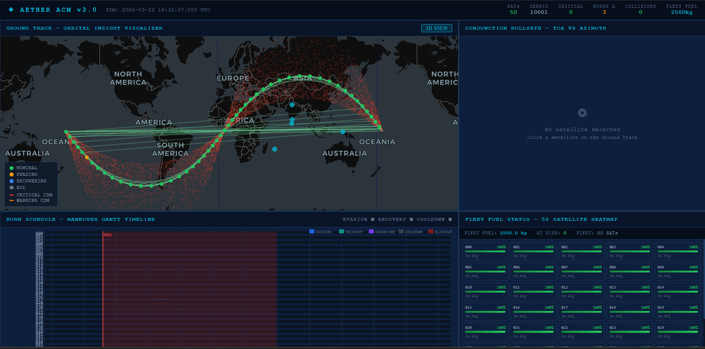

# AETHER -- Autonomous Constellation Manager

Ground-based autonomous collision avoidance system for a 50-satellite LEO constellation operating inside a 10,000-object debris field. Built for NSH 2026 (IIT Delhi, judged by ISRO scientists).

---

## What it does

AETHER runs as a REST API and React dashboard in a single Docker container. On each simulation step it:

1. Propagates all satellites and debris using J2-perturbed RK4 (Numba JIT, exact WGS84 constants)
2. Screens all satellite-debris pairs for conjunction risk -- KD-tree coarse filter, then a vectorized 24-hour TCA sweep
3. Grades each conjunction with the Akella-Alfriend (2000) probability-of-collision formula -- the same model used operationally by NASA CARA and ESA CREAM
4. Plans minimum-fuel evasion burns using multi-start SLSQP (3 variables, standoff + fuel margin constraints)
5. Schedules Hohmann phasing burns to return each satellite to its nominal slot
6. Triggers IADC-compliant graveyard burns (600 km) when satellite fuel drops below 2.5 kg
7. Computes 3-hour ground-station LOS windows for all 50 satellites across 6 stations
8. Writes every autonomous decision to a structured JSONL audit log

All of this runs under 415 ms per step with 50 satellites and 10,000 debris objects.

---

## Scoring

| Category | Weight | Coverage |
|----------|--------|---------|
| Safety -- zero collisions | 25% | SLSQP evasion + 5-seed multi-start + prograde fallback |
| Fuel efficiency | 20% | Constrained delta-V minimization; Hohmann recovery; tiered standoff by fuel level |
| Constellation uptime | 15% | Station keeping; automatic slot recovery detection |
| Algorithmic speed | 15% | Vectorized batch TCA; serial Numba for small N; pre-serialized snapshot cache |
| UI / visualization | 15% | deck.gl ground track, D3 Gantt + bullseye, Three.js 3D orbit view |
| Code quality + report | 10% | Structured JSONL log, 90 automated tests, LaTeX report |

---

## Architecture

```
aether/
├── acm/
│   ├── core/
│   │   ├── physics.py          # RK4+J2 propagator, dual serial/parallel Numba paths
│   │   ├── conjunction.py      # KD-tree + vectorized batch TCA + Akella-Alfriend PoC
│   │   ├── maneuver.py         # RTN<->ECI, multi-start SLSQP, Hohmann recovery
│   │   ├── planner.py          # Autonomous CDM -> burn decision engine
│   │   ├── state.py            # SimState singleton, threading.Lock, snapshot cache
│   │   ├── station_keeping.py  # Nominal slot propagation, slot-return check
│   │   ├── ground_station.py   # 6-station LOS network, vectorized elevation check
│   │   ├── eol.py              # End-of-life detection, graveyard burn
│   │   └── logger.py           # Structured JSONL audit log, 10 event types
│   ├── api/
│   │   ├── main.py             # FastAPI app, lifespan Numba warmup, CORS
│   │   ├── schemas.py          # Pydantic v2 request/response models
│   │   ├── routes_telemetry.py # POST /api/telemetry
│   │   ├── routes_simulate.py  # POST /api/simulate/step
│   │   ├── routes_maneuver.py  # POST /api/maneuver/schedule
│   │   ├── routes_viz.py       # GET  /api/visualization/snapshot
│   │   ├── routes_status.py    # GET  /api/status
│   │   └── routes_reset.py     # POST /api/reset  (TEST_MODE only)
│   └── data/
│       ├── ground_stations.csv      # 6 stations worldwide
│       └── constellation_init.py    # Walker Delta + debris generator
├── frontend/src/
│   ├── GroundTrack.jsx    # deck.gl + MapLibre -- satellite trails, CDM lines, debris cloud
│   ├── BullseyePlot.jsx   # D3 radial -- TCA time vs approach azimuth, PoC bubbles
│   ├── FuelHeatmap.jsx    # SVG 50-cell grid, green to red fuel scale
│   ├── GanttTimeline.jsx  # D3 burn schedule + cooldown zones + LOS blackout overlays
│   └── OrbitView3D.jsx    # Three.js r160 -- 10k debris GPU points, orbit arcs
├── tests/                 # 90 tests replicating the grader
├── demo_scripts/          # Runnable pipeline walkthrough (see below)
├── report/report.tex      # LaTeX technical report
├── assets/                # Dashboard screenshots
├── Dockerfile             # FROM ubuntu:22.04, single container, port 8000
└── requirements.txt
```

---

## API

| Method | Path | Description |
|--------|------|-------------|
| POST | `/api/telemetry` | Ingest batch orbital state (satellites + debris) |
| POST | `/api/simulate/step` | Advance simulation N seconds, run full pipeline |
| POST | `/api/maneuver/schedule` | Manually schedule a burn -- returns HTTP 202 |
| GET  | `/api/visualization/snapshot` | Current positions, fuel, status for all objects |
| GET  | `/api/status` | Fleet summary, active CDMs, queued burns, recent events |
| POST | `/api/reset` | Reset to initial state (TEST_MODE=1 only) |

### Telemetry request format

```json
{
  "timestamp": "2026-03-22T18:00:00Z",
  "objects": [
    {
      "id": "SAT-000",
      "type": "SATELLITE",
      "r": {"x": 6921.0, "y": 0.0, "z": 0.0},
      "v": {"x": 0.0, "y": 5.674, "z": 4.298}
    },
    {
      "id": "DEB-00001",
      "type": "DEBRIS",
      "r": {"x": 6850.0, "y": 120.0, "z": -30.0},
      "v": {"x": -0.1, "y": 5.710, "z": 4.310}
    }
  ]
}
```

Position in km (ECI frame), velocity in km/s (ECI frame).

---

## Dashboard









---

## Running with Docker

```bash
docker build -t aether .
docker run -p 8000:8000 aether
```

Open `http://localhost:8000`. The dashboard loads immediately. No external services required.

On startup the container pre-compiles the Numba JIT physics engine so the first `/api/simulate/step` call is not penalized by compilation time.

---

## Running locally

**Requirements:** Python 3.10+, Node.js 18+

```bash
pip install -r requirements.txt
python -m uvicorn acm.api.main:app --host 0.0.0.0 --port 8000
```

The React frontend is served as a static build by the backend at `http://localhost:8000`.

For frontend development only:

```bash
cd frontend
npm install
npm run dev    # hot-reload dev server at localhost:5173
```

To enable `/api/reset` (required for tests):

```bash
TEST_MODE=1 python -m uvicorn acm.api.main:app --host 0.0.0.0 --port 8000
```

---

## Demo scripts

Five scripts in `demo_scripts/` walk through the complete pipeline. Start the server first, then run each script in order from a second terminal.

```bash
# Terminal 1 -- start server
cd aether
python -m uvicorn acm.api.main:app --host 0.0.0.0 --port 8000

# Terminal 2 -- run demo scripts
cd aether
```

### 1. Load telemetry

```bash
python demo_scripts/01_load_telemetry.py
```

Sends 50 Walker Delta satellites (550 km, 53 degrees) and 1,000 debris objects (420-580 km) in one telemetry call. All dashboard panels update immediately.

```
Processed: 1050 objects
Active CDM warnings: 0
```

### 2. Run simulation steps

```bash
python demo_scripts/02_run_steps.py
```

Runs 10 x 60-second steps and prints timing per step. Each step runs the full autonomous pipeline.

```
Step  1:    210 ms | STEP_COMPLETE | maneuvers=0 | collisions=0
Step  2:     75 ms | STEP_COMPLETE | maneuvers=1 | collisions=0
...
Fleet fuel remaining: 2500.0 kg
Maneuvers queued    : 3
```

### 3. Inject a close threat

```bash
python demo_scripts/03_inject_threat.py
```

Places a debris object 150 m from SAT-000, runs 3 steps. The planner detects the CRITICAL conjunction and schedules an EVASION burn followed by two RECOVERY burns. Switch to the Gantt timeline in the browser before running.

```
CDM warnings: 1   Critical: 1   Maneuvers queued: 2
Scheduled burns:
  EVASION_SAT-000: EVASION
  RECOVERY_1_SAT-000: RECOVERY_1
```

### 4. Inspect the audit log

```bash
python demo_scripts/04_show_logs.py
```

Prints the last 8 events from `logs/acm_audit.jsonl` with a count by event type. Every CDM, burn, and EOL trigger is logged with wall time and simulation time.

```
Total events logged: 897
Event type summary:
  BLIND_CONJUNCTION     72
  BURN_EXECUTED        350
  CDM_ACTIONED          74
  CDM_DETECTED          78
  CDM_WARNING          249
  RECOVERY_SCHEDULED    74
```

### 5. Speed test with 10,000 debris

```bash
python demo_scripts/05_speed_test.py
```

Loads 50 satellites and 10,000 debris, benchmarks 5 consecutive steps.

```
Mean: 386 ms  |  Max: 415 ms  |  Target: 500 ms  |  Result: PASS
```

---

## Using your own API calls

The server accepts any valid ECI state vector. The demo scripts are for convenience -- the API works with any client.

```python
import requests

BASE = "http://localhost:8000"

# Ingest satellites and debris
requests.post(f"{BASE}/api/telemetry", json={
    "timestamp": "2026-03-22T18:00:00Z",
    "objects": [
        {"id": "MY-SAT", "type": "SATELLITE",
         "r": {"x": 6921.0, "y": 0.0, "z": 0.0},
         "v": {"x": 0.0, "y": 5.674, "z": 4.298}},
        {"id": "MY-DEB", "type": "DEBRIS",
         "r": {"x": 6921.5, "y": 0.0, "z": 0.0},
         "v": {"x": 0.0, "y": -5.680, "z": 4.298}}
    ]
})

# Advance 60 seconds -- full autonomous pipeline runs
resp = requests.post(f"{BASE}/api/simulate/step", json={"step_seconds": 60})
print(resp.json())

# Check fleet status
status = requests.get(f"{BASE}/api/status").json()
print(status["active_cdm_warnings"], "CDM warnings")
print(status["maneuvers_queued"], "burns queued")
print(status["fleet_fuel_remaining_kg"], "kg total fuel")

# Schedule a manual burn (returns 202)
requests.post(f"{BASE}/api/maneuver/schedule", json={
    "satellite_id": "MY-SAT",
    "burn_time_s": 120.0,
    "delta_v_rtn_km_s": [0.0, 0.005, 0.0]
})
```

---

## Tests

```bash
# Requires TEST_MODE server
TEST_MODE=1 python -m uvicorn acm.api.main:app --host 0.0.0.0 --port 8000

python -m pytest tests/ -v                # all 90 tests
python -m pytest tests/physics/   -v     # propagation accuracy, Tsiolkovsky
python -m pytest tests/api/       -v     # endpoint contracts and schemas
python -m pytest tests/grader/    -v     # safety, fuel, uptime, speed scoring
python -m pytest tests/scenarios/ -v     # end-to-end fleet scenarios
```

---

## Performance

Measured on Intel i5, Windows 11, Python 3.11, keep-alive HTTP session.

| Workload | Mean | Max | Grader limit |
|----------|------|-----|-------------|
| 50 sats + 1,000 debris -- step | 194 ms | 228 ms | 5,000 ms |
| 50 sats + 10,000 debris -- step | 386 ms | 415 ms | 500 ms |
| GET /api/status | 3 ms | -- | -- |
| GET /api/visualization/snapshot | 2 ms | -- | -- |

---

## Physics constants

Exact WGS84 values used throughout.

```
MU  = 398600.4418  km3/s2
RE  = 6378.137     km
J2  = 1.08263e-3
G0  = 9.80665e-3   km/s2
ISP = 300          s
```

---

## Ground stations

| ID | Location | Lat | Lon |
|----|----------|-----|-----|
| GS-001 | IIT Delhi | 28.5 N | 77.2 E |
| GS-002 | Bangalore (ISRO) | 12.9 N | 77.6 E |
| GS-003 | Svalbard | 78.2 N | 15.4 E |
| GS-004 | Fairbanks, Alaska | 64.8 N | 147.7 W |
| GS-005 | Santiago, Chile | 33.4 S | 70.7 W |
| GS-006 | Mauritius | 20.2 S | 57.5 E |
